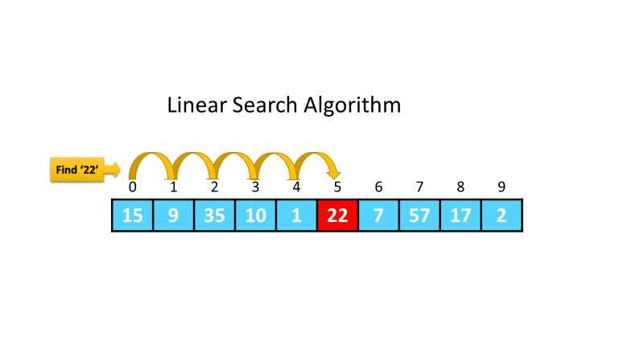

# Linear Search Algorithm

The Linear Search algorithm is a simple search method that sequentially checks each element in an array. It compares the target value with each element, one by one, and returns the index of the target if it finds a match. If the target is not found, the algorithm returns -1.

## How it works:
1. Start from the first element of the array.

2. Compare the current element with the target value.

3. If they match, return the index of the element.

4. If no match is found after checking all elements, return -1.

## Complexity Analysis:
### Time Complexity: 

O(n), where n is the number of elements in the array.

- Best Case*: The best case occurs when the target element is the first element in the array, leading to an immediate match and requiring only 1 comparison (O(1)).

- Worst Case: The worst case happens when the target element is either at the end of the array or not present at all, resulting in the algorithm needing to check every element in the array, leading to n comparisons (O(n)).

- Average Case: On average, the Linear Search will check about half of the elements in the array, which still gives it a time complexity of O(n).

- **Space Complexity:** O(1), as it uses only a few variables and doesn't require extra space.

## Valuable Resources
[W3Schools - Linear Search Page](https://www.w3schools.com/dsa/dsa_algo_linearsearch.php)

## Youtube Videos 

