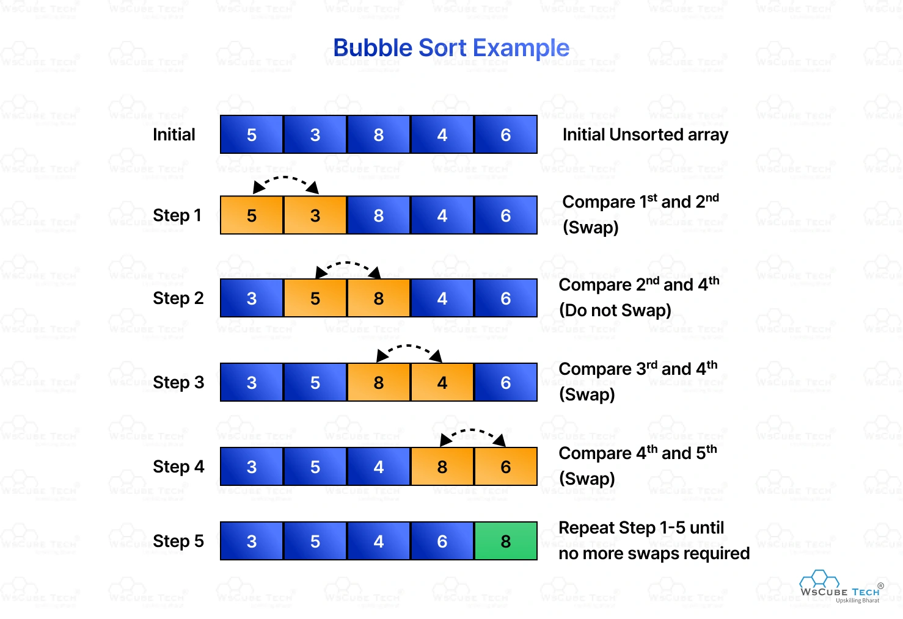

# 🚀 Bubble Sort:

Bubble Sort is one of the most well-known and easy-to-understand sorting algorithms. Its name comes from how the largest elements "bubble" to the top of the array as it progresses through multiple iterations.

## 💡 How It Works

Imagine you’re sorting a stack of cards, and for each pair of adjacent cards, you compare them and swap them if they’re out of order. This process repeats until the array is sorted. Here’s a step-by-step breakdown:

1. Go through the array, one value at a time.
2. For each value, compare the value with the next value.
3. If the value is higher than the next one, swap the values so that the highest value comes last.
4. Go through the array as many times as there are values in the array.

## Time Complexity

Bubble Sort is simple but not the most efficient. Here's how its time complexity breaks down:

- **Best Case:** O(n) – If the array is already sorted, Bubble Sort will only need one pass through the array (with no swaps).

- **Average and Worst Case:** O(n^2) – In the worst case, when the array is completely reversed, the algorithm will perform n^2 comparisons and swaps.

- **Space Complexity:** O(1) – Bubble Sort sorts in-place, requiring no extra memory.

## Videos to watch 

I Coded Sorting Algorithms

Bubble Sort Algorithm Tutorial in Java - How Fast Is It?

Bubble sort in 2 minutes